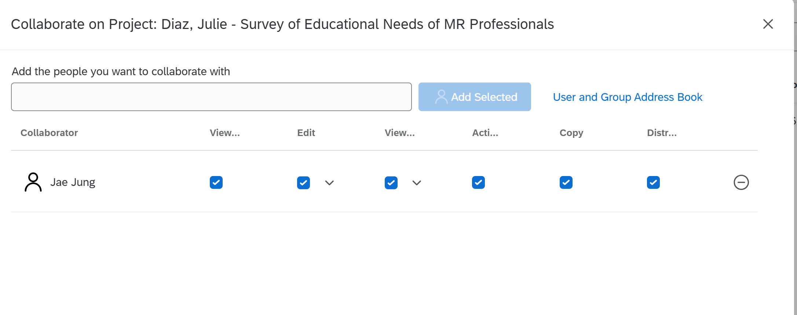
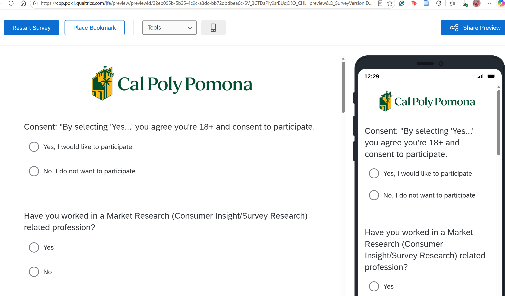
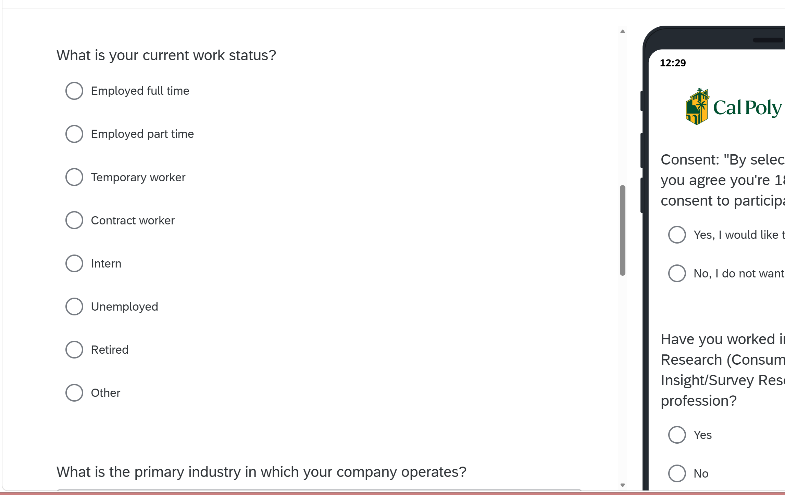
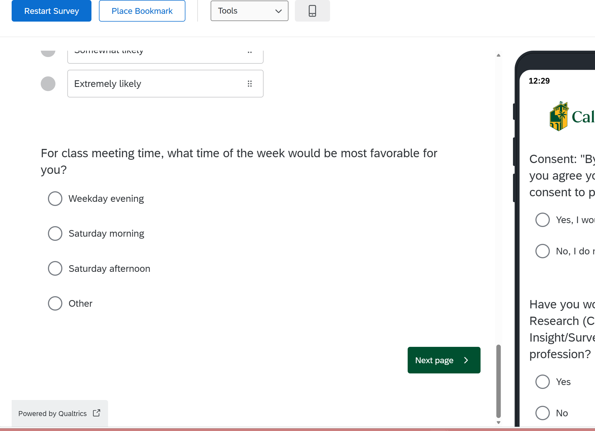

## Proof of Sharing with Jae Jung

Screenshot below shows the Qualtrics "Collaborate on Project" panel with Jae Jung (Bronco ID: jmjung) added with full edit/view rights.

## Rough Draft of the Qualtrics Survey

### Beginning of Survey

### Middle of Survey

### End of Survey

## Appendix

- GitHub Repo: [https://github.com/jukedz/M01-1-Qualtrics-Survey](https://github.com/jukedz/M01-1-Qualtrics-Survey)
- GitHub Pages: [https://jukedz.github.io/M01-1-Qualtrics-Survey/Qualtrics_M01-1_Designing_a_Survey-Julie.html](https://jukedz.github.io/M01-1-Qualtrics-Survey/Qualtrics_M01-1_Designing_a_Survey-Julie.html)
